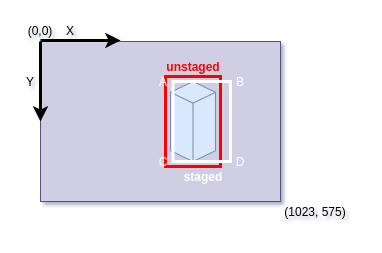

# ALOV dataset creator from video sequences with GOTURN aiding

Copyright (c) 2020-2021 [Antmicro](https://www.antmicro.com)

This repository contains a tool for annotating videos for single object detection and tracking and converting the videos and annotations into the [ALOV dataset](http://alov300pp.joomlafree.it/dataset-resources.html) format.
The consecutive bounding boxes are proposed by the GOTURN tracker.

## ALOV dataset structure

The sample dataset directory structure is following:

* `dataset root`:
    * `sequence-1`
        * `00000001.jpg`
        * `00000002.jpg`
        * `00000003.jpg`
        * `00000004.jpg`
        * `00000005.jpg`
        * `00000006.jpg`
        * `...`
        * `annotations.ann`
    * `sequence-2`
        * `00000001.jpg`
        * `00000002.jpg`
        * `00000003.jpg`
        * `...`
        * `annotations.ann`
    * `sequence-3`
        * `00000001.jpg`
        * `00000002.jpg`
        * `...`
        * `annotations.ann`
    * `...`

Each `sequence-X` directory represents single video sequence with the tracked object.
The object should be present in all of the frames.
Each frame in the sequence is stored in a separate file.

The `annotations.ann` file contains the annotations.
Each defined bounding box is represented by a single line in the `annotations.ann` file.

The format of the bounding box definition is following:

    <image-id> <Ax> <Ay> <Bx> <By> <Cx> <Cy> <Dx> <Dy>

Where `<image-id>` is the ID of the frame (indexing starts from 1) for a given sequence.
The coordinates are floating points that are coordinates in the image (not normalized, these are the pixel coordinates in a given frame, starting from top-left corner).

The order of `A`, `B`, `C`, `D` points is presented in [Usage section](#usage).

The sample dataset with ALOV sequences can be found in the [sample-dataset directory](sample-dataset/).

## Requirements

Follow the requirements in the [GOTURN to install dependencies](https://github.com/davheld/GOTURN#install-dependencies).

## Building

Run the following command in the root directory of the project:

    mkdir build
    cd build
    cmake ..
    make -j`nproc`

## Obtaining weights

To download weights, run:

    wget http://cs.stanford.edu/people/davheld/public/GOTURN/trained_model/tracker.caffemodel -O nets/tracker.caffemodel

## Usage

To get the information about available flags, run:

    ./alov-dataset-creator -h

To start a new ALOV dataset in the from the video file, run:

    cd ./build
    mkdir dataset-dir/
    ./alov-dataset-creator --input-video video-file.mp4 dataset-dir/

This will extract frames from `video-file.mp4` and save them as JPG files.

If the frames are already available as JPG, the `--input-video` flag can be omitted.

After the GOTURN model loads, the GUI with the first frame will appear.

The GUI is as follows:

- green border of the window means the frame is first in the sequence for the ALOV dataset sequence,
- blue border of the window means the frame is last in the sequence for the ALOV dataset sequence,
- red bounding box denotes unstaged bounding box for the current frame,
- white bounding box denotes staged bounding box for the current frame (this bounding box will be saved).

Controls for GUI:

- `H` - display help for GUI in the terminal with available key controls,
- `ESC` - quit the application without saving,
- `SPACE` - toggle pause/playing,
- `J` - move one frame back,
- `K` - move one frame forward,
- `1` - stage unstaged (red) bounding box in the current frame,
- `A` - stage all unstaged bounding boxes,
- `C` - toggle automatically staging all consecutive bounding boxes,
- `2` - reset unstaged bounding box to the staged bounding box for the current frame (the tracker is reinitialzed),
- `R` - reset all unstaged bounding boxes to match staged bounding boxes (the tracker for the current frame is reinitialized),
- `S` - save the annotations,
- `(` - set the current frame to be the first frame in the ALOV sequence,
- `)` - set the current frame to be the last frame in the ALOV sequence,
- `+` - speed up playing the video sequence two times (up to 1x speed),
- `-` - slow down playing the video sequence two times,
- `I` - initialize the tracker with the current unstaged bounding box,
- `O` - initialize the tracker with the current staged bounding box,
- `Q` - toggle using tracker for consecutive frames,
- `&` - go to the first frame,
- `*` - go to the last frame.

At the beginning, select the object to track with a mouse - the first bounding box will be marked as unstaged (red bounding box).
Next, press `SPACE` to automatically track the object with the GOTURN tracker.
To pause, press `SPACE`.
You can use `J` and `K` to move across frames.
You can change the bounding box by re-selecting the bounding box with a mouse.
This will automatically reinitialize the tracker for the current frame.
To temporarily turn off the tracker (this will stop bounding box proposals and reinitialization), press `Q`.

To stage the bounding box for the current frame press `1`.
To stage all bounding boxes within the first and last frame press `A`.

To save annotations between the first and the last frame, all bounding boxes must be staged.
Only the staged bounding boxes will be saved, the unstaged bounding boxes will be ignored.
To save the annotations file, press `S`.
This will save annotations as `dataset-dir/annotations<first-frame-id>-<last-frame-id>.ann`.
After saving the annotations, close the application by pressing `ESC`.

To review the annotations files for a given `dataset-dir/annotations<first-frame-id>-<last-frame-id>.ann`, run:

    ./alov-dataset-creator dataset-dir/ --first-frame <first-frame-id> --last-frame <last-frame-id> --input-annotations dataset-dir/annotations<first-frame-id>-<last-frame-id>.ann

## Demo

## Conversion tools

The [converters/ directory](converters/) contains tools for converting the ALOV-format datasets to another datasets.

### Converting dataset sequences to detection dataset

[alov_to_yolo_dataset.py script](converters/alov_to_yolo_dataset.py) creates detection dataset from the tracking dataset sequences.

In addition to generated dataset in ALOV-format, the script requires a `sequence_object_classes` file describing what is the class of the object in each video sequence.
For each used sequence from the tracking dataset there is a separate line in the file in format:

    <sequence-directory-name> <class-name>

For example, for the [sample-dataset](sample-dataset/) there is only one sequence, where the tracked object is of class `dog`.
The `sequence_object_classes.txt` file may look as follows:

    sequence-1 dog

To generate a detection dataset in format acceptable in training YOLO detectors (from the [Darknet framework](https://github.com/AlexeyAB/darknet)), run:

    python converters/alov_to_yolo_dataset.py ./sample-dataset ./sequence_object_classes.txt ./detection-dataset --use-every 10 --train-frames-percentage 0.4 --validation-frames-percentage 0.1 --seed 12345

In the above command:

* `./sample-dataset` is the path to the project's sample dataset
* `./sequence_object_classes.txt` is the file with sequence-to-class mapping
* `./detection-dataset` is the path where the output detection dataset will be stored
* `--use-every 10` means that instead of using all frames from each sequence, only every 10-th frame will be used (useful when the number of similar frames should be reduced),
* `--seed 12345` means all selected images from sequences will be shuffled with the given seed,
* `--train-frames-percentage 0.4` means that 40% of shuffled images from sequences will be used to form train dataset
* `--validation-frames-percentage 0.1` means that 10% of shuffled images from sequences will be used to form validation dataset (the images used for train dataset will not be used here).

The `detection-dataset` will look as follows:

    new-dataset/
    ├── backup
    ├── data
    │   ├── train
    │   │   ├── 00000000.jpg
    │   │   ├── 00000000.txt
    │   │   ├── 00000001.jpg
    │   │   ├── 00000001.txt
    │   │   ├── 00000002.jpg
    │   │   ├── 00000002.txt
    │   │   └── ...
    │   └── valid
    │       ├── 00000003.jpg
    │       ├── 00000003.txt
    │       ├── 00000004.jpg
    │       ├── 00000004.txt
    │       └── ...
    ├── data.data
    ├── data.names
    ├── test.txt
    └── train.txt

`data` directory contains images along with `txt` files with YOLO-like annotations of bounding boxes.
`data.names` has list of class names (the order in this file reflects the ID of the class in the `txt` files, starting from 0).
`test.txt` is a list of files in `data/valid`, and the `train.txt` is a list of files in `data/train`.

For more configuration options and details on the script, run:

    python3 converters/alov_to_yolo_dataset.py -h

## Licensing

The sources are published under the Apache 2.0 License, except for files located in the `third-party/` directory.
For those files the license is either enclosed in the file header or in a separate LICENSE file.
